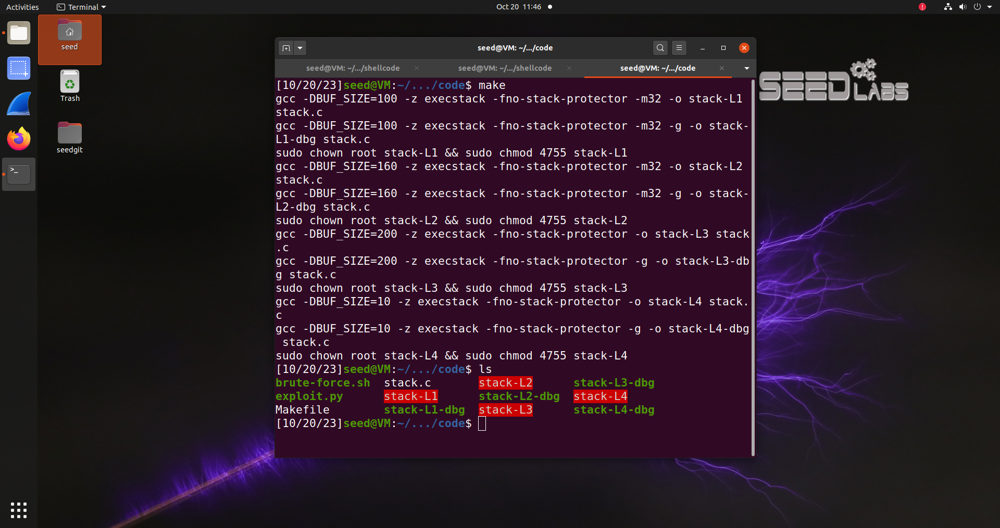
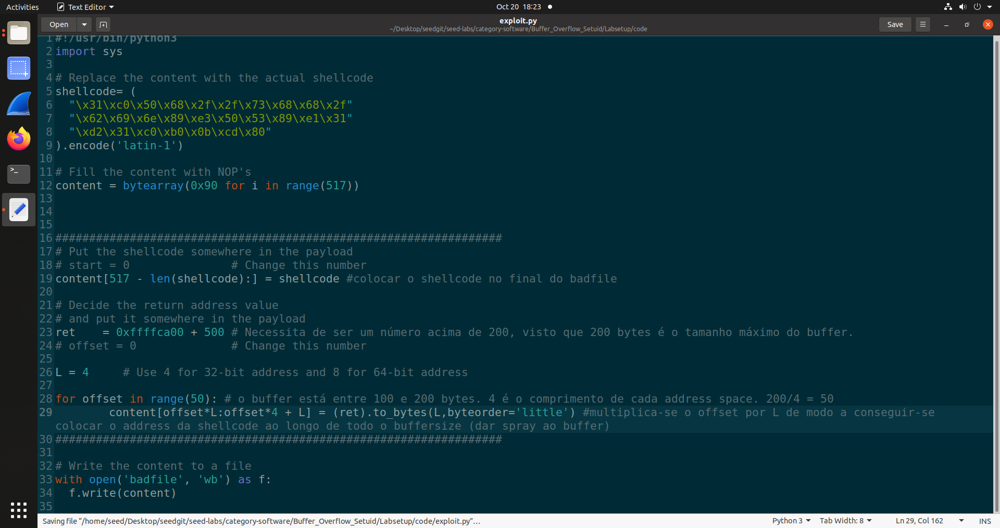
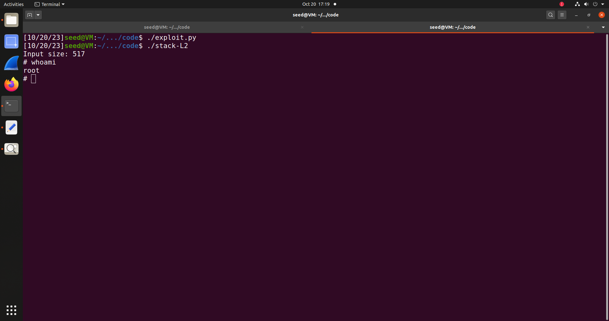

##Task 1
Primeiramente executaram-se todos os comandos indicados no guião de modo a dar setup ao nosso ambiente de ataque.
Posteriormente, entrando-se na pasta do shellcode compilou-se o ficheiro de c gerando-se os dois executáveis correspondentes ao shellcode de 32 bits e ao shellcode de 64 bits com "make setuid". E xecutando qualquer um dos shellcodes, é aberta uma nova shell no terminal, a root shell. 

##Task 2
Setup do ataque. Executou-se o Makefile na pasta code criando-se todos os ficheiros necessários.

##Task 3
Correndo a stack L1 em debug e seguindo os passos do guião, foi possível registar os seguintes valores para o EBP e o endereço do buffer, respetivamente: 0xffffcaa8 e 0xffffca3c. Calculando a diferença entre estes dois valores obtemos, em decimal, 108.

Entrando agora no ficheiro exploit.py começa-se por inserir o nosso shellcode, que corresponde ao shellcode de 32 bits fornecido no ficheiro call_shellcode.c
O valor de start inserido foi um valor escolhido entre 116 e 517, visto que se estabeleceu que serão copiados 517 bytes para o buffer e que entre as posições 112 à 115 encontra-se o return adress. Escolhemos o 300.
O valor do offset corresponde a 108 + 4 = 112. Necessita-se de adicionar 4 à diferença obtida para se obter o endereço do return address devido à arquitetura do programa utilizado visto que o previous frame pointer se encontra em baixo do return adress.
O valor do ret, por sua vez corresponde à posição exata onde ficará o comando de abertura do shellcode. Obteve-se o ret somando ao endereço base obtido do buffer o valor de start em hexadecimal, sendo este valor 0xffffcb68.

Posteriormente correu-se o script exploit e o executável stack-L1, obtendo-se root access.

##Task 4
Usando agora o stack-L2, repetiram-se os primeiros passos da task 3. Correndo o executável stack-L2-dbg e colocando novamente um breakpoint na função bof, obtive-se o valor do endereço de buffer, 0xffffca00. 

Posteriormente reconstruiu-se o script exploit.py. Visto que para esta task não é permitido deduzir o tamanho do buffer tal como se fez na task 3, as variáveis offset e start já não foram necessárias, pelo que foram comentadas. Desta vez o objetivo foi dar spray ao buffer com o address da shellcode, contando que um desses endereços seja o return address. Para uma explicação mais detalhada,todas as mudanças introduzidas no script são explicadas em comentários referentes à respetiva linha de código, que constam na imagem abaixo:

Após executar este script e posteriormente o executável stack-L2, obteu-se root access.

